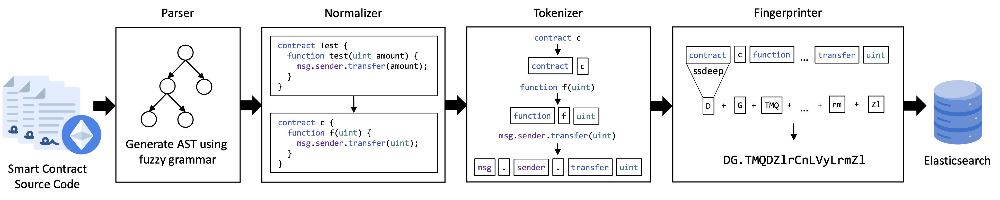

 Contract Clone Detector (CCD)
=======

A tool to detect Type I (Exact Clone), Type II (Renamed Clone), and Type III (Near-Miss Clone) code clones across smart contracts written in the Solidity programming language. CCD can handle complete as well as incomplete code (i.e., code snippets). This repository includes code, data, tools, and evaluation results from our paper on [Analyzing the Impact of Copying-and-Pasting Vulnerable Solidity Code Snippets from Question-and-Answer Websites](https://arxiv.org/pdf/2409.07586).

## Architecture



The figure above depicts the overall architecture of CCD. It generates fingerprints of Solidity source code snippets using ssdeep as its piecewise hashing function.
It then follows a hybrid approach to match similar code fragments by first retrieving similar fingerprints indexed by an Elasticsearch database in terms of n-gram similarity and then computes on the returned records an order-independent similarity score to match similar code snippets to indexed smart contracts.

## Quick Start

A container with all the dependencies can be found [here](https://hub.docker.com/r/christoftorres/contract-clone-detector/).

To run the container, please install docker and run:

``` shell
docker pull christoftorres/contract-clone-detector && docker run -it christoftorres/contract-clone-detector
```

## Custom Docker image build

``` shell
docker build -t contract-clone-detector .
docker run -it contract-clone-detector:latest
```

## Installation Instructions

### 1. Install ssdeep

##### MacOS

``` shell
brew install ssdeep
```

##### Linux

``` shell
sudo apt-get install build-essential libffi-dev python3 python3-dev python3-pip libfuzzy-dev
sudo apt-get install ssdeep
```

### 2. Install ANTLR

##### MacOS

``` shell
brew install antlr
```

##### Linux

``` shell
sudo apt-get install antlr4
```

### 3. Install Elasticsearch

##### MacOS

``` shell
brew tap elastic/tap
brew install elastic/tap/elasticsearch-full
```

##### Linux

``` shell
curl -fsSL https://artifacts.elastic.co/GPG-KEY-elasticsearch | sudo gpg --dearmor -o /usr/share/keyrings/elastic.gpg
echo "deb [signed-by=/usr/share/keyrings/elastic.gpg] https://artifacts.elastic.co/packages/7.x/apt stable main" | sudo tee -a /etc/apt/sources.list.d/elastic-7.x.list
sudo apt-get update
sudo apt-get install elasticsearch
```

### 4. Install Python dependencies

``` shell
cd CCD
python3 -m pip install -r requirements.txt
```

## Running Instructions


##### Run CCD

``` shell
# Example generate fingerprint

python3 CCD.py -g example.sol
```

``` shell
# Example store fingerprint

service elasticsearch start
python3 CCD.py -s example.sol --elasticsearch-index test
```

``` shell
# Example match fingerprint

service elasticsearch start
python3 CCD.py -m example.sol --elasticsearch-index test
```

##### Run evaluation

``` shell
cd evaluation
```

``` shell
# Install SmartEmbed and Python dependencies

docker pull christoftorres/smartembed
python3 -m pip install -r requirements.txt
```

``` shell
# Evaluate SmartEmbed

python3 evaluate_smartembed.py
```

``` shell
# Evaluate CCD

python3 evaluate_ccd.py
```

``` shell
# Compare results

python3 compare_results.py
```

``` shell
# Compare parameters

python3 compare_parameters.py
```

## Attribution

If using this repository for research, please cite as:

``` bibtex
@inproceedings{
  copypastesolidity,
  address={Madrid, Spain}, 
  title={Analyzing the Impact of Copying-and-Pasting Vulnerable Solidity Code Snippets from Question-and-Answer Websites}, 
  ISBN={979-8-4007-0592-2/24/11}, 
  DOI={10.1145/3646547.3688437}, 
  booktitle={Proceedings of the 2024 ACM Internet Measurement Conference (IMC '24)}, 
  publisher={Association for Computing Machinery}, 
  author={Weiss, Konrad and Ferreira Torres, Christof and Wendland, Florian}, 
  year={2024} 
}
```
